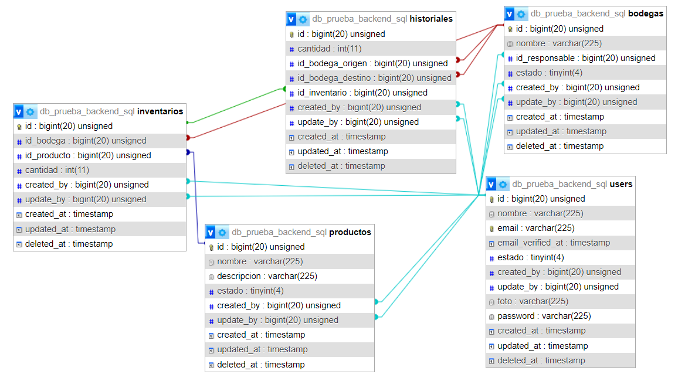

# mongoBodegas





## Proyecto de Gestión y Seguimiento 

Este repositorio contiene un sistema de gestión y seguimiento diseñado para manejar diversos aspectos de una organización, incluyendo historiales, inventarios, productos, usuarios y bodegas. El objetivo principal de este proyecto es proporcionar una plataforma eficiente para el control y administración de información crítica en una empresa o entidad.

 

## Características Principales

- **Historiales:** Registra y almacena eventos y cambios relevantes, permitiendo un seguimiento detallado de las actividades pasadas.
- **Inventarios:** Gestiona y controla el inventario de productos en diferentes bodegas, manteniendo un registro preciso de las existencias. 
- **Productos:** Administra la información de los productos, incluyendo detalles, categorías y atributos clave.
- **Usuarios:** Permite la creación, modificación y administración de cuentas de usuario con diferentes niveles de acceso y permisos. 
- **Bodegas:** Facilita la organización y supervisión de múltiples bodegas, así como la transferencia de productos entre ellas. 


## Configuración ⚙️

Antes de comenzar, asegúrate de configurar correctamente el proyecto.

### Configuración del archivo `tsconfig.json`

Asegúrate de configurar tu archivo `tsconfig.json` con los siguientes valores:

```json
{
    "compilerOptions": {
      "target": "es6",
      "module": "ES6",
      "moduleResolution": "node",
      "outDir": "./routers/storage/",
      "esModuleInterop": true,
      "experimentalDecorators": true,
      "emitDecoratorMetadata": true
    },
    "include": [
      "./routers/storage/*.ts" 
    ],
    "exclude": [
      "./routers/storage/*.js" 
    ]
}
```

### Archivo `.env`

Crea un archivo `.env` en la raíz del proyecto y completa la información necesaria:

**¡Ojo importante aver creado una base de datos y generar el cluster!**

En ATLAS_USER debes poner el usuario de tu mongodb

En ATLAS_PASSWORD debes poner la contraseña generada para tu base de datos

En ATLAS_DB se debera poner el nombre de la base de datos

En JWT_PRIVATE_KEY debera poner una key clave para mas seguridad

```env
MY_SERVER = {"hostname":"localhost", "port":5021}

ATLAS_USER=""

ATLAS_PASSWORD=""

ATLAS_DB=""

JWT_PRIVATE_KEY=""
```

## Instalación de Dependencias y Funcionamiento 🚀

Sigue estos pasos para instalar y ejecutar el proyecto:

1. Clona este repositorio en tu máquina local.
2. Abre VisualStudioCode y navega hasta la carpeta del proyecto.
3. Ejecuta el comando `npm i` para instalar todas las dependencias del proyecto.
4. Inicia el servidor con el comando `npm run dev`.
5. En otra terminal, sin cerrar la anterior, compila el archivo `tsconfig.json` con `npm run tsc`.
6. Accede a la carpeta `db` en tu entorno de MongoDB y ejecuta el contenido del archivo `query.mongodb` para configurar la base de datos y las colecciones.
7. Continúa con el paso de [Generar Tokens](https://file+.vscode-resource.vscode-cdn.net/c%3A/Users/Juan/Documents/NodeJS/MongoDB/MongoExpress/README.md#generar-tokens) para poder utilizar los endpoints.

#### Dependencias trabajadas

```
"devDependencies": {
    "class-transformer": "0.5.1",
    "class-validator": "0.14.0",
    "dotenv": "16.3.1",
    "express": "4.18.2",
    "express-rate-limit": "6.8.1",
    "jose": "4.14.4",
    "mongodb": "5.7.0",
    "nodemon": "3.0.1",
    "reflect-metadata": "0.1.13",
    "typescript": "5.1.6"
  }
```


## Generar Tokens 🔑

Para utilizar los endpoints, deberás generar tokens para cada colección. Sigue estos pasos:

1. En tu navegador o cliente API, ingresa la siguiente URL con el nombre de la colección deseada para obtener un token:

   ```
   http://localhost:5022/token/:collection
   ```

   Reemplaza :collection con uno de los siguientes nombres:

   - historiales
   - bodegas
   - inventarios
   - productos
   - users
   - mongo

2. Copia el token generado.

3. Abre tu cliente API (como Thunder) y configura el header:

   ```
   Authorization: Token generado
   ```

   Asegúrate de reemplazar "Token generado" con el token que copiaste.

## Endpoints 🛣️

4. Realizar un EndPolnt que permita listar todas las bodegas ordenadas alfabéticamente. [Metodo GET]

```
http://localhost:5021/bodegas/get/alphabetic

Debe aparecer:
{
    "_id": 104,
    "nombre": "Bodega Cuaternaria",
    "id_responsable": 504,
    "estado": 1,
    "created_by": 404,
    "update_by": 404,
    "created_at": "2023-08-19T00:00:00.000Z",
    "updated_at": "2023-08-19T00:00:00.000Z",
    "deleted_at": "2023-08-20T00:00:00.000Z"
  }...
```


5. Realizar un EndPolnt que permita crear una bodegas.(agregar en los comentarios de la función los datos de entrada).[Metodo POST]

```
http://localhost:5021/bodegas/post

Datos a ingresar en el body del ThunderClient
{
    "_id": 107,
    "nombre": "Bodega Sexta",
    "id_responsable": 506,
    "estado": 2,
    "created_by": 406,
    "update_by": 406,
    "created_at": "2023-06-30",
    "updated_at":"2002-12-12",
    "deleted_at": "2005-03-22"
 }
```


6. Realizar un EndPoint que permita listar todos los productos en orden descendente por el campo "Total". • El campo "Total" es la cantidad de unidades que la empresa tiene de este producto, considerando la unión de todas las bodegas, es decir que el dato como tal no existe en la base de datos,sino se debe calcular. Si la Bodega A tiene 1O unidades, la Bodega B tiene 5 unidades y la Bodega C tiene 3 unidades. Total= 18.
   [Metodo GET]

```
http://localhost:5021/productos/orden/total
Debe salir
 {
    "_id": 206,
    "nombre": "producto100",
    "descripcion": "producto10000",
    "estado": 2,
    "created_by": 20,
    "update_by": 234,
    "created_at": "2023-08-16T00:00:00.000Z",
    "updated_at": "2023-08-16T00:00:00.000Z",
    "deleted_at": null,
    "Total": 200
  },...

```


7. Realizar un EndPoint que permita insertar un productos y a su vez asigne una cantidad inicial del mismo en la tabla inventarios en una de las bodegas por default.[Metodo POST]

```
http://localhost:5021/productos/insert/invetarios/bodeg

Debe Insertar el siguiente body al thunder
{
  "_id": 206,
  "nombre": "producto100",
  "descripcion": "producto10000",
  "estado": 2,
  "created_by": 20,
  "update_by": 234,
  "created_at": "2023-08-16",
  "updated_at": "2023-08-16",
  "deleted_at": null,
  "id_bodega": 106, 
  "id_producto": 206,
  "cantidad": 200
}
```


8. Realizar un EndPoint que permita insertar registros en la tabla de inventarios, los parámetros de entradadebenser (id_producto,id_bodega,cantidad). • La tabla no puede repetir la combinación de Bodega I Producto Por lo tanto será necesario validar si el ingreso que se está realizado ya existe o es una combinación totalmente nueva. • Si es una combinación totalmente nueva, se debe hacer un lnsert, considerando los datos ingresados. • Si es una combinación existente, entonces se debe hacer un Update a este registro, considerando la suma de la cantidad existente con la cantidad nueva.

9. Realizar un EndPolnt que permita Trasladar unproducto de una bodega a otra 

• Se debe validar que la cantidad de unidades que se pretende sacar de una Bodega, sea posible, ya que si tengo 1O unidades en la Bodega A, no podré sacar de ella 20 unidades. Esta acción debe generar una alerta e impedir el registro. 

• Para la afectación de las tablas se debe considerar que del Origen debo restar la cantidad,y al destino le debo sumar lacantidad. Por ejemplo: Bodega A = 1O unidades. Bodega B = 1O unidades. Haré el traslado de 5 unidades desde la Bodega A para la Bodega B,Por lo cual el resultado será hacer Updated a los dos registros en inventarios: Bodega A = 5 unidades. Bodega B = 15 unidades. Además hacer un lnsert con toda la información en la tabla de historiales.

